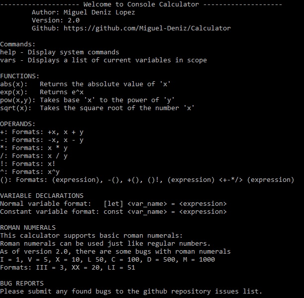
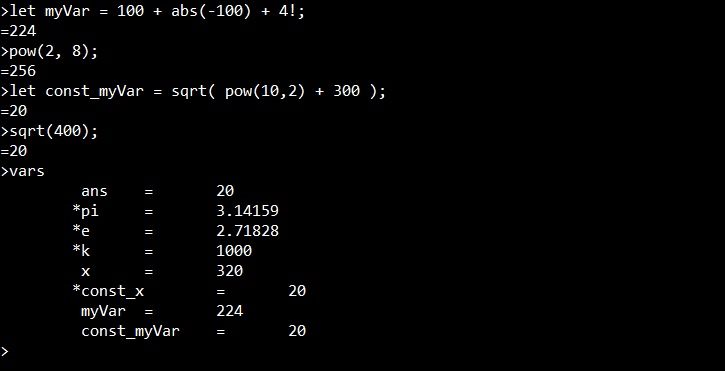

# C++ Console Calculator Version 2.0

Author: Miguel Deniz Lopez

This code implements a simple console application calculator.  Following the textbook "Pogramming: Principles and Practice using C++ (second edition)" by Bjarne Stroustrup. The calculator was implemented following a grammar to parse the expressions.

<h2>Functionality</h2>
1. Solve expressions following order of operations.
2. Built in functions such as abs(), exp(), sqrt(), and pow().
3. Declare variables and constants.
4. Use decimal and roman numerals in an expression. ex "20" or "XX"
5. Several built in commands to help the user.

<h2>Sample Expressions</h2>

  

<h2>Setup</h2>
To install and configure the program you will need an IDE, such as Visual Studio 2013, and a copy of the source code.
The code does not use any special libraries, and should be easily configured in any environment.  Download the repository to your local matchine and run the program.
