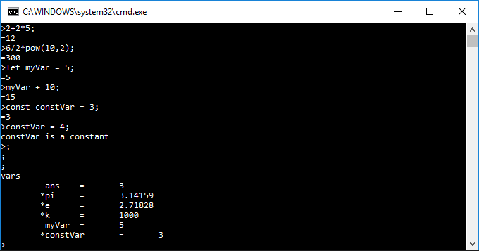

# C++ Console Calculator Version 1.0

Author: Miguel Deniz Lopez

This code runs a simple console application calculator.  Following the textbook "Pogramming: Principles and Practice using C++ (second edition)" by Bjarne Stroustrup.

<h2>Functionality</h2>
1. Solve expressions following order of operatioins.
2. Built int functions such as sqrt() and pow()
3. Declare variables and constants.
4. Use decimal or roman numerals. ex "20" or "XX"
5. Several built in commands to help the user.

<h2>Setup</h2>
To install and configure the program you will need an IDE, such as Visual Studio 2013, and a copy of the source code.
The code does not use any special libraries, and should be easily configured in any environment.  Download the two files "std_lib_facilities.h" written by Bjanre Stroustrup and "main.cpp". Put these two files into your IDE and hit run.

<h2>Joining The Team</h2>
If you want to join me and code small projects such as this one feel free to message me. Any improvements to the code will be welcomed.
